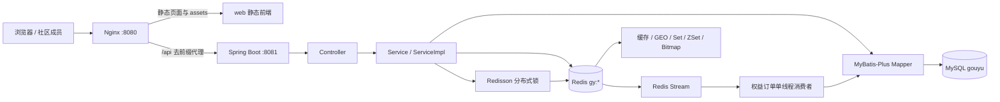
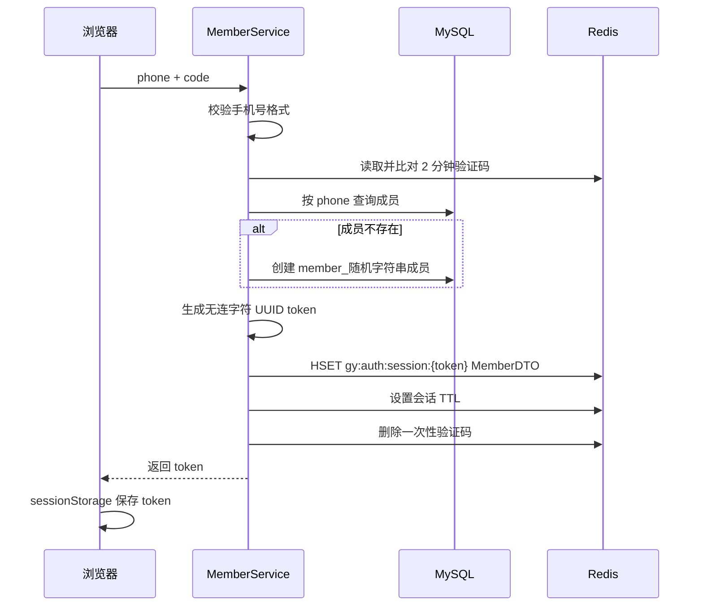
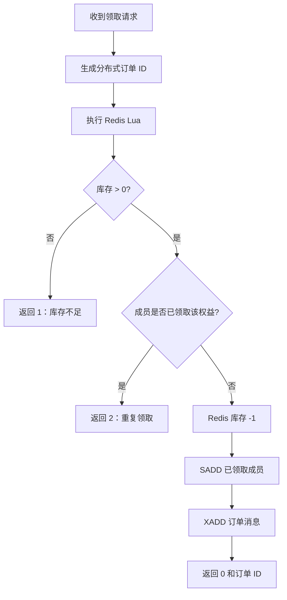

# 构域（GouYu Community）项目总结

> 文档版本：V3.0
>
> 总结日期：2026-07-18
>
> 项目目录：`gouyu-community`
>
> Maven 坐标：`com.gouyu:gouyu-community:0.0.1-SNAPSHOT`
>
> 当前分支：`codex/gouyu-equivalent-refactor`
>
> 公开仓库：`https://github.com/wxou/redis`

## 1. 项目概述

构域是一套面向校园、产业园区及相对封闭生活场域的本地社区服务平台。项目把“成员、商户、社区内容、社交关系和商户权益”组织在同一个应用中，为成员提供附近商户发现、社区动态发布、关注互动、每日打卡和限时权益领取等能力。

项目当前采用单体架构：Spring Boot 提供 REST API，MySQL 保存核心业务数据，Redis 同时承担登录会话、业务缓存、GEO 检索、点赞排行、关注集合、Feed 收件箱、Bitmap 打卡、分布式 ID、分布式锁及 Stream 消息队列等职责；前端使用 Vue 2、Axios 和 Element UI，以静态 HTML 页面形式由 Nginx 托管。

构域并非从零开发的新业务，而是在保持原有核心流程和 Redis 算法的基础上完成的一次“领域等价包装”。改造已经覆盖工程身份、Java 包与类型、数据库、API、Redis Key、Lua、Stream、前端文案与资源、Nginx 和交付文档，使当前工程能够以构域身份独立启动，不再依赖原项目的数据库、缓存命名空间、页面资源或运行目录。

一句话概括：

> 构域是一套以 Redis 实战能力为技术核心、连接园区成员与周边商户的社区生活平台。

## 2. 产品定位与使用场景

### 2.1 产品定位

构域服务于“一个部署实例对应一个校园或园区”的场景。当前模型没有引入多租户、空间 ID 或租户隔离字段，因此更适合以下部署方式：

- 一所学校部署一套构域实例；
- 一个产业园区部署一套构域实例；
- 一个社区或生活服务区域部署一套构域实例；
- 作为 Redis、Spring Boot 和高并发业务实践的完整教学或演示项目。

### 2.2 核心用户

当前系统的主要用户是社区成员。成员可以通过手机号登录，浏览商户和社区动态，关注其他成员，发布自己的动态，完成每日打卡，并领取商户发布的限时权益。

项目暂未形成独立的商户后台、运营后台或管理员权限体系。商户和权益新增接口存在，但属于 API 能力，不代表已经具备完整的后台管理产品。

### 2.3 典型业务场景

1. 成员进入首页，浏览园区服务分类和热门社区动态。
2. 成员按分类查看商户；如果浏览器提供坐标，则按距离查看附近商户。
3. 成员打开商户详情，查看商户资料和可领取权益。
4. 成员登录后领取限时权益，系统通过 Lua 原子判断库存和重复领取，再通过 Redis Stream 异步写入 MySQL。
5. 成员选择商户、上传图片并发布社区动态。
6. 其他成员可以点赞动态、关注作者，并在自己的关注流中看到作者后续发布的动态。
7. 成员每天打卡，系统使用 Redis Bitmap 计算截至当天的连续打卡天数。

## 3. 当前完成状态

截至 2026-07-18，项目已经完成以下交付：

- 工程、包名、启动类和 Maven 坐标全部切换为构域命名；
- 独立 `gouyu` 数据库、11 张业务表和 1 张认证审计表已经建立；
- Redis 运行数据统一进入 `gy:*` 命名空间；
- 领域对象、Service、Mapper、Controller、DTO 和工具类完成构域语义改造；
- API 资源切换为 `/member`、`/merchant`、`/benefit`、`/post` 等构域资源；
- 10 个静态前端页面完成构域品牌、文案、接口和本地资源适配；
- Windows Nginx 1.18 已复制到项目内，可直接托管前端并代理后端；
- MySQL、Redis、后端和 Nginx 已完成真实环境启动验证；
- 原有 32 个可调用路由对应的 42 个端到端业务场景全部通过；本轮扩展为 35 个路由，并新增 18 项认证安全联调断言；
- 异步权益订单已经验证 Redis 扣减、Stream 投递、消费者处理、MySQL 落库和库存一致性；
- 登录、登出、关注、Feed、点赞、上传删除等跨模块链路已经完成联调；
- 联调产生的测试成员、商户、动态、权益、订单、会话和 Redis 消息均已精确清理；
- Maven 打包成功并生成可运行 Spring Boot Jar。

`PostCommentController` 当前只有领域入口，没有声明可调用方法，因此不计入 35 个可调用路由。

## 4. 系统总体架构



### 4.1 架构特点

- **前后端同源访问**：浏览器只访问 Nginx 的 8080 端口，避免跨域配置；Axios 使用 `/api` 作为统一前缀。
- **单体分层后端**：Controller、Service、Mapper 和 Entity 分层明确，适合中小型应用和教学演示。
- **MySQL 与 Redis 分工**：MySQL 是核心业务事实存储；Redis 提供读性能、快速状态判断、排序、地理检索和异步消息能力。
- **同步请求与异步写入结合**：普通查询和写入直接访问数据库；高并发限时权益先在 Redis 内原子判断，再异步落库。
- **领域命名隔离**：数据库使用 `gouyu/gy_*`，Redis 使用 `gy:*`，不会与原项目运行数据混用。

## 5. 项目规模与目录结构

当前源码规模快照：

| 项目 | 数量 |
| --- | ---: |
| Java 主源码 | 82 个文件 |
| Java 测试源码 | 4 个文件 |
| 静态 HTML 页面 | 10 个 |
| `web/assets` 本地资源 | 50 个文件 |
| Markdown 项目文档 | 8 份（含本总结） |
| MySQL 表 | 12 张（11 张业务表、1 张认证审计表） |
| 可调用 API 路由 | 35 个 |
| 联调覆盖 | 原 42 个业务场景 + 18 项认证安全断言 |

目录结构：

```text
gouyu-community/
├─ pom.xml                         Maven 构建与依赖
├─ README.md                       项目入口说明
├─ CLAUDE.md                       本项目协作与开发说明
├─ src/
│  ├─ main/
│  │  ├─ java/com/gouyu/
│  │  │  ├─ config/               MVC、Redisson、异常处理配置
│  │  │  ├─ controller/           REST 控制器
│  │  │  ├─ dto/                  请求、响应与游标分页对象
│  │  │  ├─ entity/               MyBatis-Plus 实体
│  │  │  ├─ mapper/               数据访问接口
│  │  │  ├─ service/              业务接口
│  │  │  ├─ service/impl/         业务实现
│  │  │  └─ utils/                缓存、锁、ID、上下文和常量
│  │  └─ resources/
│  │     ├─ application.yaml      应用与基础设施配置
│  │     ├─ limited_benefit.lua   限时权益原子校验脚本
│  │     ├─ unlock.lua            分布式锁安全解锁脚本
│  │     ├─ db/gouyu.sql          独立数据库初始化脚本
│  │     └─ mapper/               自定义 Mapper XML
│  └─ test/                       集成型测试与令牌辅助代码
├─ web/                            Vue 2 静态前端
│  ├─ *.html                       10 个业务页面
│  ├─ js/                          Vue、Axios、Element UI 与公共请求封装
│  ├─ css/                         页面样式
│  └─ assets/                      品牌、分类、商户、动态和 UI 图片
├─ deploy/nginx/                   Windows Nginx 1.18 运行时
└─ docs/                           计划、映射、API、数据库、Redis 和回归文档
```

## 6. 技术栈

### 6.1 后端与数据层

| 技术 | 版本 | 作用 |
| --- | --- | --- |
| Java | 源码目标 1.8 | 应用开发语言 |
| Spring Boot | 2.3.12.RELEASE | 应用容器、Web 与配置管理 |
| Spring MVC | 随 Spring Boot | REST API、拦截器与异常处理 |
| MyBatis-Plus | 3.4.3 | CRUD、条件构造器、分页和 Mapper |
| MySQL Connector | 5.1.47 | MySQL JDBC 驱动 |
| Spring Data Redis | 2.6.2 | Redis String、Hash、Set、ZSet、GEO、Bitmap、Stream 操作 |
| Lettuce | 6.1.6.RELEASE | Redis 客户端与连接池 |
| Redisson | 3.13.6 | 分布式锁 |
| Hutool | 5.7.17 | Bean、JSON、字符串、UUID、随机码等工具 |
| Lombok | 1.18.30 | 简化实体和 DTO 样板代码 |
| AspectJ Weaver | 随依赖解析 | 暴露 AOP 代理，保证异步消费者中的事务调用 |

### 6.2 前端与部署

| 技术 | 作用 |
| --- | --- |
| Vue 2 | 页面状态与交互 |
| Axios | API 请求、令牌注入和统一错误处理 |
| Element UI | 输入框、按钮、标签页、评分等组件 |
| 原生 HTML/CSS/JavaScript | 移动端页面布局和局部交互 |
| Nginx 1.18.0 | 静态资源服务和 `/api` 反向代理 |

### 6.3 实际验证环境

本次完整联调使用的真实环境为：

- Windows 本机 MySQL 8.0.45，监听 `127.0.0.1:3306`；
- VMware CentOS 内 Redis 6.2.6，监听 `192.168.100.128:6379`；
- Spring Boot 监听 `8081`；
- 项目内 Nginx 监听 `8080`；
- 前端和 API 通过 `http://127.0.0.1:8080` 统一访问。

基础设施口令没有写入仓库，运行时通过 `GOUYU_*` 环境变量注入。

## 7. 领域模型

### 7.1 核心实体

| 实体 | 表 | 含义 | 主要关系 |
| --- | --- | --- | --- |
| `Member` | `gy_member` | 登录主体和成员基本信息 | 一名成员可发布动态、关注成员、领取权益 |
| `MemberProfile` | `gy_member_profile` | 城市、简介、粉丝、关注数、生日、积分和等级 | 以 `member_id` 与成员一对一 |
| `MerchantCategory` | `gy_merchant_category` | 商户服务分类 | 一个分类包含多个商户 |
| `Merchant` | `gy_merchant` | 园区商户、地址、坐标、评分和营业信息 | 属于分类，可关联权益和动态 |
| `Benefit` | `gy_benefit` | 普通或限时权益的基础信息 | 属于商户；限时类型拥有库存扩展记录 |
| `LimitedBenefit` | `gy_limited_benefit` | 限时权益的库存和有效时间窗口 | 与 `Benefit` 一对一 |
| `BenefitOrder` | `gy_benefit_order` | 成员领取权益的记录 | 关联成员和权益 |
| `Post` | `gy_post` | 成员发布的社区动态 | 关联作者和商户 |
| `PostComment` | `gy_post_comment` | 动态评论数据模型 | 关联动态、作者、父评论和回复目标 |
| `FollowRelation` | `gy_follow_relation` | 成员关注关系 | `member_id` 关注 `target_member_id` |

### 7.2 DTO 与响应对象

- `LoginRequest`：包含 `phone`、`code` 和 `password`。
- `MemberDTO`：只暴露 `id`、`displayName` 和 `avatarUrl`，避免把手机号、密码等实体字段写入 Redis 会话和 API 响应。
- `ApiResult`：统一响应对象，字段为 `success`、`errorMsg`、`data` 和 `total`。
- `CursorPageResult`：关注流滚动分页对象，字段为 `list`、`minTime` 和 `offset`。

统一响应示例：

```json
{
  "success": true,
  "errorMsg": null,
  "data": {},
  "total": null
}
```

运行时异常由 `GlobalExceptionHandler` 捕获，服务端记录完整堆栈，客户端收到 `ApiResult.fail("服务器异常")`。鉴权失败是例外：拦截器直接返回 HTTP 401。

## 8. 成员与会话模块

### 8.1 验证码发送

`POST /member/code` 首先使用正则工具校验手机号，再生成 6 位随机数字，将验证码写入：

```text
gy:auth:code:{phone}
```

TTL 为 2 分钟。当前项目无法接入真实短信平台，因此提供明确的本地开发替代方案：`gouyu.auth.expose-code=true` 时，接口把验证码放在 `ApiResult.data` 中，前端自动回填；生产环境必须将 `GOUYU_EXPOSE_LOGIN_CODE` 设为 `false`，此时验证码只保留在 Redis，等待后续短信适配器发送。

### 8.2 登录与自动注册

登录流程：



会话以 Redis Hash 保存，默认空闲 TTL 为 120 分钟，请求会滑动续期；Hash 内保存签发时间，最长 7 天后必须重新登录。前端公共 Axios 拦截器从 `sessionStorage` 读取 token，并放入 `authorization` 请求头。

登录支持验证码和密码两种互斥方式。验证码不存在、过期或不匹配都会失败，成功后立即删除；密码要求 8 至 20 位并使用 BCrypt 存储，历史盐值 MD5 在首次验证成功后自动升级。成员可在个人页设置/修改密码，也可通过验证码重置密码。

验证码发送和登录均使用 Redis Lua 原子限流：同手机号 60 秒发送冷却、24 小时 10 次，同 IP 每小时 30 次；登录同 IP 10 分钟 30 次，单账号 15 分钟内失败 5 次后锁定 15 分钟。安全事件写入 `gy_auth_audit_log`，只保存脱敏手机号和 Token SHA-256 摘要，默认保留 180 天。

### 8.3 请求鉴权与会话续期

系统注册三个有顺序的 MVC 拦截器：

1. `SessionRefreshInterceptor`，顺序 0：
   - 读取 `Authorization` 请求头；
   - 查询 `gy:auth:session:{token}`；
   - 把 Redis Hash 转成 `MemberDTO`；
   - 保存到 `MemberContext` 的 ThreadLocal；
   - 刷新会话 TTL。
2. `AuthInterceptor`，顺序 1：
   - 检查 ThreadLocal 是否存在成员；
   - 不存在则返回 HTTP 401；
   - 请求结束后清理 ThreadLocal。
3. `WriteAuthInterceptor`，顺序 1：
   - 保持商户、权益和上传资源的 GET 读取公开；
   - 对 POST、PUT、DELETE 以及图片删除操作补充登录校验；
   - 未登录写请求返回 HTTP 401。

公开路径包括验证码、登录、热门动态、商户与分类读取、权益读取。动态写入、关注、权益订单、签到、成员资料、商户/权益管理写入和上传均需要登录。

### 8.4 登出

`POST /member/logout` 根据请求头中的 token 删除 `gy:auth:session:{token}`。联调已经验证：登出成功后继续用旧 token 请求 `/member/me`，返回 HTTP 401。

### 8.5 每日打卡

成员每月使用一个 Bitmap：

```text
gy:check-in:{memberId}:{yyyyMM}
```

当天打卡把 `dayOfMonth - 1` 位设置为 1。连续打卡统计使用 `BITFIELD GET u{dayOfMonth} 0` 读取当月截至今天的位，再从最低位开始执行按位与和无符号右移，遇到第一个 0 停止。该方案把一个成员一个月的打卡状态压缩到少量字节，适合高频、布尔型、按日期索引的数据。

## 9. 商户与分类模块

### 9.1 分类缓存

商户分类按 `sort` 升序查询，完整列表序列化为 JSON 存入：

```text
gy:cache:merchant-category:list
```

配置 TTL 为 3600 分钟。后续请求直接从 Redis 反序列化，减少对稳定字典表的查询。

### 9.2 商户详情缓存

当前实际启用的是缓存空值防穿透方案：

1. 查询 `gy:cache:merchant:{id}`；
2. 命中非空 JSON 时直接反序列化；
3. 命中空字符串时认为数据库不存在该商户；
4. 未命中时查询 MySQL；
5. 数据存在则缓存 30 分钟；
6. 数据不存在则缓存空字符串 2 分钟。

`RedisCacheClient` 还实现了逻辑过期和互斥锁异步重建方案，`MerchantServiceImpl` 也保留了三类方案的教学代码，但当前商户详情查询只启用缓存空值方案。

商户更新采用 Cache Aside：先更新数据库，再删除 `gy:cache:merchant:{id}`，让下一次读取重新回源。

### 9.3 分类分页查询

未提供坐标时，系统直接按 `category_id` 查询 MySQL，默认页大小为 5。

### 9.4 附近商户 GEO 查询

提供 `x` 和 `y` 后，系统从以下 GEO Key 查询：

```text
gy:merchant:geo:{categoryId}
```

查询半径为 5000 米，按距离升序，先在 Redis 中取得商户 ID 和距离，再使用 MySQL `IN` 查询商户详情，并通过 `ORDER BY FIELD` 恢复 Redis 的距离顺序。最终把距离写入实体的非表字段 `distance`。

这种方式避免在 MySQL 中实时执行复杂距离计算，同时保留数据库作为商户详情的事实来源。

### 9.5 名称搜索

`GET /merchant/of/name` 使用 MyBatis-Plus `LIKE name` 分页搜索，单页最大返回 10 条。前端发布动态时通过该接口选择关联商户。

## 10. 社区动态模块

### 10.1 动态发布

登录成员发布动态时，后端覆盖请求中的 `memberId`，使用当前会话成员作为作者。动态写入 MySQL 后，系统查询作者的全部粉丝，并将动态 ID 写入每个粉丝的 Feed ZSet：

```text
key    = gy:feed:{followerMemberId}
member = postId
score  = 发布时间毫秒时间戳
```

这是典型的“推模式”或“写扩散”实现：发布时成本随粉丝数量增长，读取关注流时非常快，适合普通成员粉丝量有限的社区场景。

### 10.2 热门动态

热门动态直接按 MySQL `like_count` 倒序分页，每页最多 10 条。每条动态返回前会补充作者昵称、头像，以及当前登录成员的点赞状态。

### 10.3 点赞与取消点赞

动态点赞使用 ZSet：

```text
key    = gy:post:liked:{postId}
member = memberId
score  = 点赞时间戳
```

操作流程：

- ZSet 中不存在成员：MySQL `like_count + 1`，成功后写入 ZSet；
- ZSet 中已存在成员：MySQL `like_count - 1`，随后从 ZSet 删除成员；
- 查询点赞列表时读取前 5 个成员，再从 MySQL 查询成员摘要并保持 ID 顺序；
- 查询动态详情时，通过 ZSet `score` 判断当前成员是否已点赞。

联调期间修复了点赞 SQL 使用 Java 字段名 `likeCount` 的问题，当前原始 SQL 正确使用数据库列 `like_count`。

### 10.4 关注流滚动分页

关注流使用 ZSet 时间戳作为分数，以 `lastId` 和 `offset` 做滚动分页：

1. `ZREVRANGEBYSCORE` 按时间倒序读取 2 条；
2. 提取动态 ID、当前页最小时间和同分值偏移量；
3. 用 MySQL 批量查询动态并恢复 ID 顺序；
4. 返回 `CursorPageResult(list, minTime, offset)`；
5. 前端下一页把 `minTime` 和 `offset` 原样传回。

该方案解决了普通页码分页在动态数据持续插入时容易出现重复或遗漏的问题，也处理了多条动态具有相同毫秒时间戳的情况。

## 11. 关注关系模块

关注关系同时写入 MySQL 和 Redis：

- MySQL `gy_follow_relation` 保存持久关系；
- Redis `gy:following:{memberId}` Set 保存当前成员关注的目标成员 ID。

关注时先写数据库，成功后执行 `SADD`；取消关注时先删数据库，成功后执行 `SREM`。关注状态查询当前使用 MySQL 计数，共同关注使用两个 Redis Set 的 `SINTER`，然后批量查询成员摘要。

项目发布动态时通过 MySQL 查询作者粉丝；共同关注通过 Redis 计算交集。两类存储各自服务于不同访问模式。

## 12. 权益与高并发领取模块

### 12.1 普通权益和限时权益

`gy_benefit` 保存权益标题、规则、门槛金额、权益金额、类型和状态。限时权益还会在 `gy_limited_benefit` 保存库存、开始时间和结束时间。

新增限时权益时，系统执行一个事务：

1. 保存 `gy_benefit`；
2. 保存 `gy_limited_benefit`；
3. 把初始库存写入 `gy:limited-benefit:stock:{benefitId}`。

写入前会校验库存必须大于 0、开始时间早于结束时间；领取前再次从 MySQL 校验权益存在以及当前时间位于有效窗口内。Redis 库存 Key 意外缺失时，服务会从 MySQL 库存执行 `SETNX` 恢复，避免 Lua 对空值执行数值比较。

### 12.2 分布式 ID

权益订单 ID 由 `DistributedIdGenerator` 生成，结构是：

```text
高 32 位：当前 UTC 秒 - 2026-01-01 基准秒
低 32 位：gy:id:benefit-order:{yyyy:MM:dd} 的当日自增序列
```

该方式不依赖数据库自增，支持多实例并行生成趋势递增的 64 位 ID。

### 12.3 Lua 原子校验

限时权益请求不会先查 MySQL，而是执行 `limited_benefit.lua`：



库存 Key：

```text
gy:limited-benefit:stock:{benefitId}
```

去重集合：

```text
gy:limited-benefit:order:{benefitId}
```

集合成员是 `memberId`，因此规则是“一名成员对同一个权益只能领取一次”，但可以领取其他权益。联调中修复了去重 Key 错用成员 ID、导致成员领取一次后无法领取任何其他权益的问题。

Lua 把库存判断、重复判断、扣减、去重记录和消息写入放在 Redis 单线程执行环境中，避免并发请求之间的检查与修改竞态。

### 12.4 Redis Stream 异步落库

Lua 将 `id`、`memberId`、`benefitId` 写入：

```text
Stream   gy:stream:benefit-orders
Group    gy-benefit-order-group
Consumer gy-benefit-order-consumer-{实例随机后缀}
```

应用启动时会幂等创建 Stream 与消费组（已存在时忽略 `BUSYGROUP`），随后创建单线程消费者：

1. 每次通过消费组读取 1 条消息，最多阻塞 2 秒；
2. 将消息字段转换成 `BenefitOrder`；
3. 按成员 ID 获取 Redisson 分布式锁；
4. 通过 `TransactionTemplate` 执行事务方法，不依赖首次请求初始化 AOP 代理；
5. 再次查询 MySQL，进行一人一权益校验；
6. 使用 `stock = stock - 1 WHERE stock > 0` 扣减数据库库存；
7. 保存权益订单；
8. 成功后 ACK 消息。

发生异常时，消费者进入 Pending List 处理循环，读取未确认消息并重试，成功后再 ACK。

### 12.5 双重防护

权益领取同时具备：

- Redis Lua 原子库存和去重；
- Redisson 成员粒度分布式锁；
- MySQL 重复记录查询；
- MySQL 条件库存扣减；
- Redis Stream Pending List 重试。
- 数据库 `(member_id, benefit_id)` 联合唯一约束。

`GET /benefit-order/{id}` 只允许当前成员查询自己的订单，用于确认异步落库状态。最终联调已经验证：接口返回订单 ID后，客户端轮询在 3 秒内查到订单，Redis 库存完成扣减，Stream 被消费者处理，MySQL 生成对应订单，数据库库存同步扣减。

## 13. Redis 数据结构总览

构域所有运行 Key 使用 `gy:` 前缀。

| Key 模式 | 类型 | TTL | 用途 |
| --- | --- | --- | --- |
| `gy:auth:code:{phone}` | String | 2 分钟 | 登录验证码 |
| `gy:auth:session:{token}` | Hash | 空闲 120 分钟、最长 7 天 | 成员会话与签发时间 |
| `gy:auth:limit:*` | String | 60 秒至 24 小时 | 验证码与登录请求限流计数 |
| `gy:auth:failure:*` / `gy:auth:lock:*` | String | 2 至 15 分钟 | 验证失败计数与账号锁定 |
| `gy:cache:merchant:{id}` | String | 30 分钟 | 商户详情 JSON |
| `gy:cache:merchant-category:list` | String | 3600 分钟 | 商户分类 JSON |
| `gy:lock:merchant:{id}` | String | 10 秒 | 缓存重建互斥锁 |
| `gy:limited-benefit:stock:{id}` | String | 无固定 TTL | 限时权益库存 |
| `gy:limited-benefit:order:{id}` | Set | 无固定 TTL | 该权益的领取成员集合 |
| `gy:post:liked:{postId}` | ZSet | 无固定 TTL | 点赞成员与点赞时间 |
| `gy:feed:{memberId}` | ZSet | 无固定 TTL | 成员关注流收件箱 |
| `gy:following:{memberId}` | Set | 无固定 TTL | 成员关注集合 |
| `gy:merchant:geo:{categoryId}` | GEO | 无固定 TTL | 分类下商户坐标 |
| `gy:check-in:{memberId}:{yyyyMM}` | Bitmap | 无固定 TTL | 月度打卡状态 |
| `gy:id:benefit-order:{date}` | String | 无固定 TTL | 分布式 ID 日计数器 |
| `gy:stream:benefit-orders` | Stream | 无固定 TTL | 权益领取消息流 |
| `gy:lock:benefit-order:{memberId}` | Redisson Lock | 看门狗/主动释放 | 权益订单成员锁 |

Redis 在本项目中不是单纯缓存，而是承担了认证状态、业务索引、排序、集合运算、地理位置、时序状态、消息队列和并发控制等多类职责。

## 14. MySQL 数据库设计

### 14.1 数据库隔离

数据库名为 `gouyu`，表统一使用 `gy_` 前缀。初始化脚本位于：

```text
src/main/resources/db/gouyu.sql
```

脚本只操作独立构域库，不删除原项目数据库。

### 14.2 表结构摘要

| 表 | 核心字段 | 当前演示数据快照 |
| --- | --- | ---: |
| `gy_member` | phone、display_name、avatar_url | 1005 |
| `gy_member_profile` | city、introduce、fans、followee、credits、level | 0 |
| `gy_check_in_record` | member_id、year、month、date | 0 |
| `gy_merchant_category` | name、icon、sort | 10 |
| `gy_merchant` | category_id、address、x、y、average_price、score | 14 |
| `gy_benefit` | merchant_id、threshold_amount、benefit_amount、type、status | 1 |
| `gy_limited_benefit` | benefit_id、stock、starts_at、ends_at | 0 |
| `gy_benefit_order` | member_id、benefit_id、status、支付/使用/退款时间 | 0 |
| `gy_post` | merchant_id、member_id、image_urls、like_count、comment_count | 4 |
| `gy_post_comment` | post_id、parent_comment_id、reply_to_comment_id、content | 0 |
| `gy_follow_relation` | member_id、target_member_id | 0 |

以上数量是测试数据清理后的当前环境快照，不是固定业务限制。

### 14.3 字段与索引约定

- 主键普遍使用 `id`；一对一扩展表使用业务主键，如 `benefit_id`、`member_id`。
- 关联字段统一使用 `member_id`、`merchant_id`、`benefit_id`、`post_id` 和 `category_id`。
- 审计字段统一使用 `created_at`、`updated_at`。
- Java 驼峰字段通过 MyBatis-Plus 映射到下划线列。
- `gy_member.phone` 有唯一索引。
- `gy_merchant.category_id` 有普通索引。
- 当前数据库主要依靠应用维护关联，没有声明完整的数据库外键约束。
- `gy_benefit_order(member_id, benefit_id)` 和 `gy_follow_relation(member_id, target_member_id)` 均有联合唯一约束，数据库与应用共同保证幂等。

## 15. API 总览

前端统一访问 `/api`，Nginx 去掉前缀后转发给后端。登录成功后使用 `authorization` 请求头。

### 15.1 成员 API

| 方法 | 路径 | 鉴权 | 说明 |
| --- | --- | --- | --- |
| POST | `/member/code` | 否 | 发送验证码 |
| POST | `/member/login` | 否 | 手机号登录/自动注册 |
| POST | `/member/logout` | 是 | 删除当前 Redis 会话 |
| GET | `/member/me` | 是 | 当前成员摘要 |
| GET | `/member/{id}` | 是 | 查询成员摘要 |
| GET | `/member/info/{id}` | 是 | 查询成员扩展资料 |
| PUT | `/member/info` | 是 | 保存当前成员可编辑资料 |
| POST | `/member/check-in` | 是 | 当日打卡 |
| GET | `/member/check-in/count` | 是 | 连续打卡天数 |

### 15.2 商户与分类 API

| 方法 | 路径 | 鉴权 | 说明 |
| --- | --- | --- | --- |
| GET | `/merchant-category/list` | 否 | 分类列表 |
| GET | `/merchant/{id}` | 否 | 商户详情 |
| POST | `/merchant` | 是 | 新增商户并同步 GEO |
| PUT | `/merchant` | 是 | 更新商户、缓存与 GEO |
| GET | `/merchant/of/category` | 否 | 分类分页或 GEO 附近查询 |
| GET | `/merchant/of/name` | 否 | 名称搜索 |

### 15.3 权益 API

| 方法 | 路径 | 鉴权 | 说明 |
| --- | --- | --- | --- |
| POST | `/benefit` | 是 | 新增普通权益 |
| POST | `/benefit/limited` | 是 | 新增限时权益和 Redis 库存 |
| GET | `/benefit/list/{merchantId}` | 否 | 商户权益列表 |
| POST | `/benefit-order/limited/{id}` | 是 | 领取限时权益 |
| GET | `/benefit-order/{id}` | 是 | 查询当前成员的异步权益订单 |

### 15.4 动态 API

| 方法 | 路径 | 鉴权 | 说明 |
| --- | --- | --- | --- |
| POST | `/post` | 是 | 发布动态并推送 Feed |
| PUT | `/post/like/{id}` | 是 | 点赞或取消点赞 |
| GET | `/post/of/me` | 是 | 当前成员动态 |
| GET | `/post/hot` | 否 | 热门动态分页 |
| GET | `/post/{id}` | 是 | 动态详情 |
| GET | `/post/likes/{id}` | 是 | 最多 5 名点赞成员 |
| GET | `/post/of/member` | 是 | 指定成员动态 |
| GET | `/post/of/follow` | 是 | 关注流游标分页 |

### 15.5 关注与上传 API

| 方法 | 路径 | 鉴权 | 说明 |
| --- | --- | --- | --- |
| PUT | `/follow/{id}/{isFollowing}` | 是 | 关注或取消关注 |
| GET | `/follow/or/not/{id}` | 是 | 查询关注状态 |
| GET | `/follow/common/{id}` | 是 | 共同关注 |
| POST | `/upload/post` | 是 | 上传动态图片 |
| GET | `/upload/post/delete` | 是 | 删除未使用的上传图片 |

## 16. 前端实现

### 16.1 页面清单

| 页面 | 主要功能 |
| --- | --- |
| `index.html` | 分类入口、热门动态、点赞、滚动加载 |
| `login.html` | 手机号验证码登录 |
| `login2.html` | 密码登录与验证码重置密码 |
| `merchant-list.html` | 分类切换、附近商户列表、滚动分页 |
| `merchant-detail.html` | 商户详情、图片、评分、权益列表和权益领取 |
| `post-detail.html` | 动态图文、作者、商户、点赞成员和关注操作 |
| `post-edit.html` | 图片上传、商户搜索、动态发布 |
| `info.html` | 当前成员主页、动态、关注流、密码设置/修改和登出 |
| `other-info.html` | 其他成员主页、动态、关注状态和共同关注 |
| `info-edit.html` | 成员介绍、性别、城市、生日读取与保存 |

### 16.2 公共请求封装

`web/js/common.js` 完成：

- Axios `baseURL = /api`；
- 2 秒请求超时；
- 从 `sessionStorage` 读取 token 并写入 `authorization`；
- 统一解析 `ApiResult.success`；
- HTTP 401 时跳转登录页，并安全处理无 `response` 的断网/超时异常；
- 统一查询参数序列化；
- URL 参数读取和金额格式化工具。

### 16.3 静态资源闭环

页面使用的品牌标识、默认头像、分类图标、商户图片、动态图片和 UI 图标均保存在 `web/assets`，初始化 SQL 也使用本地资源路径，避免依赖外部图片站点。咖啡实验室、西餐厅和音乐空间新增了 3 张无文字、无品牌、无水印的原创竖版素材，同时替换对应商户主图和动态图片，消除了骑马、餐饮水印等与当前项目不符的内容。

### 16.4 当前页面边界

- 评论表和实体存在，但 `PostCommentController` 没有读写接口；动态详情页的部分评论内容属于静态展示。
- 当前未接入真实短信供应商，公开环境必须关闭验证码回显并提供短信发送适配器。
- 商户管理和权益管理没有独立运营后台，只有 API。

## 17. Nginx 与部署结构

项目内置 Windows Nginx 1.18，配置位于 `deploy/nginx/conf/nginx.conf`。

核心规则：

```text
浏览器访问 :8080/
    ├─ /              -> ../../web 静态目录
    └─ /api/*         -> 去掉 /api 后代理到 127.0.0.1:8081
```

配置还保留了一个名为 `backend` 的 upstream，包含 8081 和 8082 两个节点，但当前 `/api` 的 `proxy_pass` 直接指向 `127.0.0.1:8081`，因此 8082 并未参与实际请求分发。

## 18. 配置与启动

### 18.1 环境变量

| 变量 | 默认值 | 说明 |
| --- | --- | --- |
| `GOUYU_MYSQL_URL` | `jdbc:mysql://127.0.0.1:3306/gouyu?...` | MySQL URL |
| `GOUYU_MYSQL_USERNAME` | `root` | MySQL 用户 |
| `GOUYU_MYSQL_PASSWORD` | 空 | MySQL 密码 |
| `GOUYU_REDIS_HOST` | `127.0.0.1` | Redis 地址 |
| `GOUYU_REDIS_PORT` | `6379` | Redis 端口 |
| `GOUYU_REDIS_PASSWORD` | 空 | Redis 密码 |
| `GOUYU_IMAGE_UPLOAD_DIR` | 当前目录下 `web/assets` 的绝对路径 | 上传根目录 |

### 18.2 数据库初始化

```powershell
mysql -h 127.0.0.1 -u root -p < src/main/resources/db/gouyu.sql
```

### 18.3 Redis 初始化要求

应用运行前应确保：

- 按分类把商户坐标写入 `gy:merchant:geo:{categoryId}`；
- 把限时权益库存写入 `gy:limited-benefit:stock:{benefitId}`；
- 创建 `gy:stream:benefit-orders`；
- 创建消费组 `gy-benefit-order-group`。

当前应用消费者假设 Stream 和消费组已经存在，不负责完整的自动建组流程。

### 18.4 后端启动

```powershell
$env:GOUYU_MYSQL_PASSWORD = '<mysql-password>'
$env:GOUYU_REDIS_HOST = '<redis-host>'
$env:GOUYU_REDIS_PASSWORD = '<redis-password>'
mvn.cmd spring-boot:run
```

### 18.5 Nginx 启动

```powershell
cd deploy/nginx
./nginx.exe -p "$PWD\" -c conf/nginx.conf
```

访问地址：

```text
前端：http://127.0.0.1:8080/
API：http://127.0.0.1:8080/api
后端：http://127.0.0.1:8081/
```

### 18.6 构建

```powershell
mvn.cmd -DskipTests package
```

构建产物：

```text
target/gouyu-community-0.0.1-SNAPSHOT.jar
```

## 19. 联调与质量验证

### 19.1 最终结果

2026-07-18 完成了通过 Nginx 进入后端的完整端到端联调：

- 原有 32 个实际可调用路由、42 个业务场景全部通过；
- 当前共有 35 个实际可调用路由；
- 新增认证安全链路 18 项断言，18 通过、0 失败；
- BCrypt 单元测试 3 项，3 通过、0 失败；
- 10 个前端页面内联 JavaScript 语法全部通过；
- 前端首页 HTTP 200；
- 商户详情页 HTTP 200；
- `/api/merchant/1` HTTP 200；
- 后端成功连接 MySQL 和 Redis；
- Maven 打包成功。

### 19.2 覆盖的跨模块链路

- 开发验证码返回、真实 Redis 验证码比对、一次性删除、成员自动创建、登录、资料保存、会话读取和登出；
- 验证码发送 429/`Retry-After`、密码设置/登录/修改/重置、8 至 20 位校验、5 次失败锁定、120 分钟空闲会话与 7 天绝对期限；
- 认证审计的成功、失败和拦截事件持久化，以及测试成员、会话、审计行和手机号 Key 的精确清理；
- 商户分类、普通分页、GEO 距离分页、详情缓存、新增/更新及 GEO 同步；
- 普通权益、限时权益、商户权益列表；
- 有效期校验、Lua 库存与重复领取校验、Stream 自动初始化、异步订单落库、订单状态查询和库存扣减；
- 关注、关注状态、共同关注和取消关注；
- 动态发布、作者粉丝 Feed 推送、关注流读取；
- 动态详情、热门列表、点赞、取消点赞基础路径和点赞成员；
- 登录保护、图片类型/大小/路径校验、物理落盘和删除；
- Nginx 静态页面与 API 代理。

### 19.3 联调中发现并修复的问题

1. `MemberProfile.followRelationee` 映射成不存在的 `follow_relationee` 列，已改为 `followee`。
2. 点赞原始 SQL 使用 `likeCount`，已改为数据库列 `like_count`。
3. 登出接口原为未实现占位，现已删除 Redis 会话。
4. Lua 去重 Key 原按成员 ID 建集合，导致成员不能领取其他权益；现改为按权益 ID 建集合、以成员 ID 去重。
5. 成员资料业务主键误用 `IdType.AUTO`，显式成员 ID 在插入时被忽略；现改为 `IdType.INPUT`。
6. 商户新增/更新未同步 GEO、关注集合无法从 MySQL 重建、热门动态存在 N+1 查询等一致性和性能问题均已修复。
7. 限时权益 Stream 依赖外部初始化、固定消费者名和延迟 AOP 代理初始化的问题已改为启动期幂等建组、实例唯一消费者和 `TransactionTemplate`。
8. 上传匿名开放、路径规范化不足、前端错误拼接 `/imgs` 的问题已修复。

详细证据见 [前后端联调报告](api-integration-report.md) 和 [等价回归报告](regression-report.md)。

## 20. 当前优势

### 20.1 Redis 能力覆盖完整

单一项目中实际使用了 String、Hash、Set、ZSet、GEO、Bitmap、Stream、Lua、分布式锁和分布式计数器，且每种结构都与真实业务访问模式对应，不是孤立示例。

### 20.2 高并发权益链路具有代表性

Redis Lua 原子判断、分布式 ID、Stream 异步削峰、消费者组、Pending List、Redisson 锁、数据库条件更新和事务组合成了一条完整高并发链路，适合学习并发一致性设计。

### 20.3 读写模型有清晰区分

- MySQL 保存业务事实；
- Redis 保存快速查询索引和临时状态；
- 商户详情使用 Cache Aside；
- 关注流采用写扩散；
- 点赞和 Feed 使用时间戳排序；
- 打卡使用位图压缩。

### 20.4 工程已经独立化

项目拥有独立包名、数据库、表前缀、Redis 命名空间、API、前端、Nginx、演示数据和文档，能够作为构域项目单独交付。

### 20.5 运行凭据没有进入仓库

数据库和 Redis 地址、账号、密码通过环境变量注入，公开仓库不包含本次真实联调使用的密码和 token。

## 21. 当前限制与技术债

以下内容是认证加固和既有业务联调后的真实状态。它们不影响原 42 个业务场景及新增 18 项认证断言通过，但如果准备生产部署，应继续处理。

### 21.1 认证与权限

- 验证码校验已恢复，但由于无法接入短信服务，开发模式会在响应中返回验证码；生产环境必须关闭 `GOUYU_EXPOSE_LOGIN_CODE` 并接入发送适配器。
- 密码登录、登录后设置/修改密码和验证码重置密码已经实现；新密码为 8 至 20 位并使用 BCrypt，历史盐值 MD5 会在验证成功后升级。
- 商户、权益和上传写接口已要求登录，但没有管理员、商户或运营角色，尚不能做细粒度授权。
- 会话改为 120 分钟空闲滑动期限和 7 天绝对期限，参数可通过环境变量调整。
- 验证码发送和登录已增加 Redis 原子限流、验证码错误作废及账号失败锁定。
- 认证事件已经写入持久化审计表并按 180 天默认周期清理；业务写操作审计、设备管理、异常设备识别和更完整的风控仍未实现。

### 21.2 数据一致性

- 点赞采用先更新 MySQL、再更新 Redis ZSet，两步不在同一事务中，异常时可能不一致。
- 关注采用事务内写 MySQL、再更新 Redis Set，仍存在数据库提交成功但缓存更新失败的短暂窗口；共同关注读取时已经可以从 MySQL 重建集合。
- 新增/更新商户已经同步 GEO 并删除详情缓存，但数据库与 Redis 的跨资源更新仍没有 Outbox/消息补偿。
- 成员-权益、成员-关注已增加联合唯一约束；其他业务幂等仍需按生产场景继续审计。

### 21.3 权益订单可靠性

- 领取前已经校验有效期、自动恢复缺失的 Redis 库存，Stream/消费组由应用幂等初始化，消费者名带实例随机后缀，事务不再依赖延迟 AOP 代理。
- API 仍在消息落库前返回订单 ID，但已经提供当前成员范围内的订单查询接口，前端会短轮询确认落库；尚未定义“处理中/失败”的持久化状态模型。
- Stream 没有裁剪和归档策略，长期运行会持续增长。
- 业务失败主要记录日志，缺少死信队列、告警和人工补偿机制。

### 21.4 缓存与性能

- 商户详情当前只启用缓存空值方案，逻辑过期方案虽已实现但未启用。
- 缓存重建锁直接 `DEL`，缓存工具没有使用 Lua 校验锁所有者；`SimpleRedisDistributedLock` 的安全解锁实现则未用于缓存重建。
- 热门动态与关注流已经批量查询作者，消除了主要列表的 N+1；单条详情查询不构成列表 N+1。
- 点赞成员改为 `reverseRange 0..4`，返回最近点赞的 5 名成员。
- Feed 使用写扩散，普通成员合适，但大 V 粉丝量很大时发布成本会显著增加。

### 21.5 文件上传

- 上传已限制为 JPEG、PNG、WebP、GIF MIME，单文件和请求均限制为 5 MB，文件名由服务端生成并写入分层目录。
- 删除路径经过标准化、根目录边界检查，并且只允许删除 `web/assets/posts` 下的文件；上传和删除都需要登录。
- 当前 MIME 主要依赖客户端声明，生产环境还应增加文件签名/实际解码、恶意内容扫描和限流。
- 文件存储在单机目录，多实例部署时需要共享存储或对象存储。

### 21.6 前端完整度

- 评论、评价、粉丝数量等部分区域仍是静态占位。
- 成员资料编辑已经形成读取与保存闭环，但头像上传、粉丝/关注列表仍未完成。
- 没有正式的商户/运营管理后台。
- 请求超时固定为 2 秒，对慢网络和异步状态查询不够友好。
- 前端是多页静态应用，没有模块化构建、类型检查、自动化测试和统一状态管理。

### 21.7 测试与工程化

- 现有测试偏集成型，会连接真实 MySQL/Redis 并可能写数据，不是隔离单元测试。
- 没有独立测试配置、Testcontainers、内存数据库或专用 Redis。
- 没有仓库内 CI 工作流、Dockerfile、Docker Compose、健康检查或一键初始化脚本。
- 异常处理只捕获 `RuntimeException` 并返回统一“服务器异常”，缺少业务错误码和可观察的错误分类。
- 当前 API 文档是 Markdown，没有 OpenAPI/Swagger 可执行契约。

## 22. 生产化建议与优先级

### P0：上线前必须处理

1. 接入短信服务，生产环境关闭验证码回显，并对接供应商发送结果与告警。
2. 建立角色与权限模型，把“已登录可写”细化为管理员、商户和普通成员授权。
3. 为上传增加文件签名校验、实际图片解码、恶意内容扫描、配额和对象存储。
4. 为 Stream 增加死信、告警、重试上限、裁剪/归档和失败订单状态。
5. 把现有认证审计扩展到关键业务写操作，并增加全局接口限流、CSRF/滥用防护和安全响应头。
6. 为敏感配置接入安全配置中心或密钥管理，不只依赖本机环境变量。

### P1：可靠性和一致性

1. 为点赞、关注、GEO 和缓存双写设计补偿或消息驱动同步。
2. 增加 Stream 死信、重试上限、监控、告警和裁剪策略。
3. 增加 Redis 数据重建脚本，支持从 MySQL 恢复 GEO、关注集合和限时库存。
4. 为商户缓存选择明确的生产策略，并统一使用安全锁实现。
5. 增加幂等键、业务错误码和全链路日志字段。

### P2：产品完整度

1. 实现评论读写、评论点赞和回复。
2. 实现头像上传和粉丝/关注列表，完善成员资料校验规则。
3. 建设商户与运营管理后台。
4. 在现有权益记录查询基础上增加使用、过期和退款状态流转。
5. 完善搜索、评价和首页推荐。

### P3：工程效率

1. 增加 Docker Compose，一键启动 MySQL、Redis、后端和 Nginx。
2. 增加独立测试环境和自动清理的端到端测试脚本。
3. 建立 GitHub Actions，执行编译、测试、静态扫描和构建。
4. 引入 OpenAPI 文档、代码格式检查和依赖漏洞扫描。
5. 将前端升级为模块化工程，增加构建、Lint 和自动化测试。

## 23. 项目适用性判断

### 23.1 当前适合

- Redis 各类数据结构的综合实战项目；
- Spring Boot、MyBatis-Plus、MySQL 和 Redis 的课程设计；
- 校园/园区社区产品原型；
- 高并发限时权益领取的技术演示；
- 单机或受控内网环境的功能演示；
- 进一步做生产化改造的基础工程。

### 23.2 当前不建议直接用于

- 未经安全加固的公网生产环境；
- 多租户 SaaS；
- 大规模明星/大 V 社交 Feed；
- 对订单强一致、审计和资金安全要求很高的商业系统；
- 多节点文件存储和全球化部署。

## 24. 改造价值总结

本次构域改造的价值不只是把名称替换为 GouYu，而是形成了以下独立闭环：

- **工程闭环**：独立 Maven 坐标、包名、启动类和构建产物；
- **领域闭环**：成员、商户、权益、动态、关注的统一构域语言；
- **数据闭环**：独立数据库、表、字段、演示数据和本地图片；
- **缓存闭环**：完整 `gy:*` Redis 命名空间、Lua、Stream 和锁；
- **接口闭环**：构域 API 与前端调用同步切换；
- **部署闭环**：项目内 Nginx、环境变量和真实基础设施验证；
- **质量闭环**：编译、打包、页面、Nginx、MySQL、Redis、原 42 个业务场景和新增 18 项认证断言；
- **文档闭环**：计划、映射、API、数据库、Redis、回归和项目总结齐全。

## 25. 最终结论

构域已经是一套可以独立启动、具备完整核心演示链路的校园/园区社区平台。它的最大技术特色是把 Redis 的多种能力放进真实业务模型中：会话 Hash、商户缓存、GEO 附近查询、Set 共同关注、ZSet 点赞与 Feed、Bitmap 打卡、Lua 原子校验、Stream 异步订单、分布式 ID 和 Redisson 锁共同组成了完整系统。

从“项目包装与独立交付”的角度看，当前改造目标已经完成，并补齐了密码认证、双重会话期限、原子限流和认证审计；从“生产系统”的角度看，项目仍处在可运行原型和高质量教学工程之间，短信接入、细粒度权限、业务审计、跨存储一致性、Stream 运维、评论与运营后台、自动化测试和部署体系是下一阶段的重点。

因此，对当前项目最准确的评价是：

> 构域已完成领域独立化和核心业务闭环，并通过真实前后端联调；它是一套内容完整、Redis 特征鲜明、可继续生产化演进的社区服务平台基础工程。

## 26. 相关文档

- [项目 README](../README.md)
- [构域等价改造计划](gouyu-transformation-plan.md)
- [领域映射](domain-mapping.md)
- [API 说明](api.md)
- [数据库说明](database.md)
- [Redis Key 说明](redis-keys.md)
- [等价回归报告](regression-report.md)
- [前后端联调报告](api-integration-report.md)
