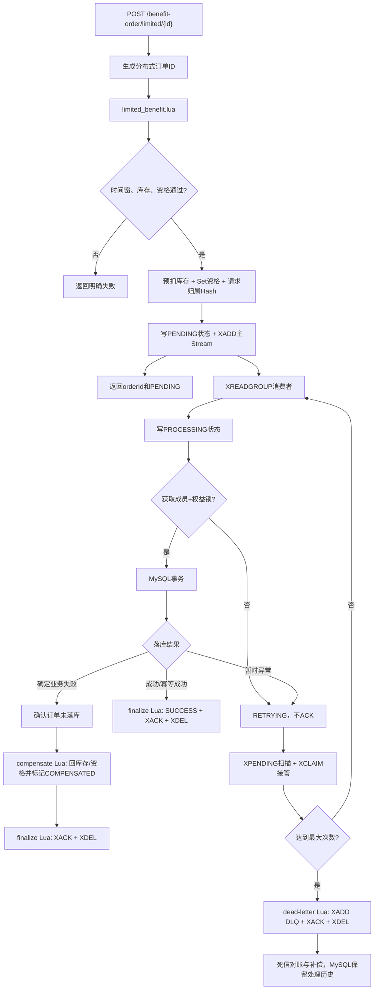

# 限时权益领取面试讲解

## 1. 文档目标与事实边界

本文面向 Java 后端校招/实习面试，用于把构域项目的限时权益领取讲到能够承受连续追问。主讲内容以当前仓库代码为准，不使用未经压测支持的 QPS、并发量和性能提升比例。

可以直接概括为：

> 我把领取拆成“Redis 原子受理”和“MySQL 异步落库”两段。Lua 一次完成时间窗、库存、资格、请求归属、处理状态和 Stream 投递；消费者以显式结果决定是否 ACK，并用跨消费者 Pending 接管、有限重试、死信隔离和幂等补偿处理异常，数据库再以条件扣减和唯一约束兜底。

事实边界：

- 已实现 Redis Stream 死信、有限重试、`XPENDING + XCLAIM`、Redis 订单处理状态和 MySQL 处理归档。
- 已实现确认 MySQL 未落单后的补偿 Lua，原子恢复 Redis 库存、领取资格并标记补偿终态。
- 没有 Outbox，也不宣称 Redis 与 MySQL 强一致；当前是可重试、可补偿的最终收敛方案。
- 没有容量压测数据，不声称具体吞吐量或数据库降压比例。

## 2. 面试主讲版本

### 2.1 30 秒版本

> 限时权益的难点是并发超卖、重复领取和异步落库失败。我使用 Lua 把有效期、库存、资格、预扣和 Stream 投递合成一次 Redis 原子操作；消费者再通过 Redisson、MySQL 条件扣减与联合唯一索引落库。处理失败时不误 ACK，由其他消费者接管 Pending，超过次数进入死信，并在确认 MySQL 没有订单后用补偿 Lua 恢复库存和资格。

### 2.2 2 分钟版本

> 如果直接按“查库存、查订单、扣库存、插订单”编写，请求之间会在检查和修改之间穿插：多个线程可能同时读到最后一份库存，也可能同时认为成员尚未领取。即使数据库最终用条件更新和唯一索引挡住错误，所有请求仍会进入热点库存行的事务路径。

> 因此我把入口决策放到 Redis。请求先生成分布式订单 ID，然后执行 Lua。脚本从 Redis 元数据校验开始和结束时间，检查库存及成员资格；通过后预扣库存，将成员写入领取 Set、把“成员到订单 ID”的请求归属写入 Hash、创建 `PENDING` 状态，并 `XADD` 一条订单消息。这些步骤要么在同一脚本中完成，要么脚本在写操作前就返回。

> 消费者使用消费组读取消息，先写 `PROCESSING` 状态，再抢“成员 + 权益”粒度的 Redisson 锁。锁失败或数据库暂时异常都会抛出可重试异常，不执行 ACK。事务内检查订单幂等性，用 `stock = stock - 1 WHERE stock > 0` 扣减 MySQL 库存，写订单及处理归档。事务成功后，终态 Lua 原子写 `SUCCESS`、`XACK` 并 `XDEL`。

> 定时任务通过 `XPENDING` 扫描整个消费组，并用 `XCLAIM` 接管空闲超时的消息，不受原消费者名称限制。达到最大处理次数后，Lua 将原始 Payload 写入死信 Stream，再 ACK 和删除主 Stream 消息。死信对账确认 MySQL 没有订单后调用补偿 Lua，只有请求归属仍等于当前订单 ID 时才恢复库存和资格，从而避免旧消息误删新请求。

### 2.3 5 分钟版本的组织顺序

1. 先讲业务不变量：库存不能为负；同一成员对同一权益最多一单；已受理请求必须有可查询结果。
2. 再讲为什么问题会产生：检查与修改分离、热点行竞争、Redis 与 MySQL 跨资源。
3. 讲请求阶段 Lua 的原子边界和返回码。
4. 讲消费者事务、Redisson 和数据库兜底。
5. 讲“什么时候 ACK”：只有成功落库、成功补偿或成功转移死信后。
6. 讲故障恢复：Pending 接管、有限重试、毒消息隔离、处理归档。
7. 最后主动说明边界：没有 Outbox、需要对账和监控、单线程消费、客户端幂等键尚未实现。

## 3. 问题是怎么产生的

### 3.1 超卖：检查与扣减不是一个原子动作

错误模型：

```text
库存 = 1
线程 A：读取库存 1
线程 B：读取库存 1
线程 A：判断可领取并扣减
线程 B：也判断可领取并扣减
```

`GET` 和 `DECR` 分别原子并不够，因为业务不变量跨越了“读、判断、改”三个步骤。Lua 的作用不是让单条命令更原子，而是让整个业务决策在 Redis 中不可被其他命令插入。

### 3.2 重复领取：先查后插仍有竞态

```text
A 查询：成员没有订单
B 查询：成员没有订单
A 插入订单
B 插入订单
```

应用查询只能优化正常路径，不能作为最终约束。因此项目同时使用：

- Redis Set 在入口快速拒绝重复领取；
- 请求归属 Hash 绑定 `memberId -> orderId`，保护补偿幂等；
- Redisson 降低同一业务键的并发处理；
- MySQL `(member_id, benefit_id)` 联合唯一索引强制最终不变量。

### 3.3 同步写 MySQL：热点进入请求延迟

若请求同步完成数据库事务，所有有效请求都会竞争同一权益库存行。Redis 前置决策可以快速挡住无库存和重复请求，仅把成功受理的订单意图交给消费者。这里的收益是缩短请求同步边界和削平数据库写入节奏，不代表已经获得某个未经压测的性能数字。

### 3.4 异步带来的新问题

异步化不会凭空消除一致性问题，而是把问题变成：

- Redis 已预扣，但 MySQL 还没有订单；
- 消费者在数据库提交前或提交后宕机；
- 锁竞争、数据库瞬时异常是否会误 ACK；
- 失联消费者的 Pending 谁来接管；
- 永远失败的毒消息是否阻塞队列；
- ACK 后 Stream 条目是否无限增长；
- 用户如何区分处理中、成功和失败。

当前改造就是逐项处理这些异步可靠性问题。

## 4. 当前完整流程



### 4.1 请求阶段返回码

`limited_benefit.lua` 返回：

| 返回码 | 含义 | 是否修改 Redis |
| ---: | --- | --- |
| `0` | 受理成功 | 原子预扣并投递消息 |
| `1` | 库存不足 | 否 |
| `2` | 重复领取 | 否 |
| `3` | 元数据或库存缺失 | 否；Java 尝试从 MySQL 恢复一次后重试 |
| `4` | 尚未开始 | 否 |
| `5` | 已结束 | 否 |

正常请求不查询 MySQL。只有 Redis 状态缺失时才走异常恢复路径，从 MySQL 重建权益元数据和库存，再重试一次 Lua。

### 4.2 订单处理状态

内部状态：

```text
PENDING -> PROCESSING -> SUCCESS
                     -> RETRYING -> PROCESSING
                     -> COMPENSATED
                     -> DEAD_LETTER
```

对用户只暴露可理解的结果：`PENDING`、`PROCESSING`、`RETRYING`、`SUCCESS`、`FAILED`。内部 `COMPENSATED` 和 `DEAD_LETTER` 映射为 `FAILED`，但保留不同提示和 MySQL 处理记录。

## 5. Redis Key 与数据结构

| Key | 类型 | 作用 |
| --- | --- | --- |
| `gy:limited-benefit:meta:{benefitId}` | Hash | 开始时间、结束时间、启用状态 |
| `gy:limited-benefit:stock:{benefitId}` | String | Redis 可领取库存 |
| `gy:limited-benefit:order:{benefitId}` | Set | 已领取成员，用于入口去重 |
| `gy:limited-benefit:request:{benefitId}` | Hash | `memberId -> orderId`，保护补偿所有权 |
| `gy:benefit-order:status:{orderId}` | Hash | 状态、提示、处理次数、更新时间 |
| `gy:stream:benefit-orders` | Stream | 主订单消息流 |
| `gy:stream:benefit-orders:dlq` | Stream | 死信 Payload |
| `gy:lock:benefit-order:{memberId}:{benefitId}` | Redisson Lock | 业务键粒度互斥 |

状态 Hash 默认保留 168 小时；具体时间、重试次数、空闲接管时间和批量大小都在 `gouyu.benefit-order` 配置项中，可通过环境变量覆盖。

## 6. 相关代码逐段讲解

### 6.1 请求入口与 DTO

入口位于 [`BenefitOrderController.java`](../src/main/java/com/gouyu/controller/BenefitOrderController.java)：

```java
@PostMapping("limited/{id}")
public ApiResult claimLimitedBenefit(@PathVariable("id") Long benefitId) {
    return benefitOrderService.claimLimitedBenefit(benefitId);
}

@GetMapping("/{id}")
public ApiResult queryOrder(@PathVariable("id") Long orderId) {
    return benefitOrderService.queryOrder(orderId);
}
```

POST 成功返回 `BenefitOrderClaimDTO`，包含 `orderId`、`PENDING` 和受理提示。GET 返回 `BenefitOrderStatusDTO`，可包含处理状态、消息、处理次数、更新时间；成功时附带真实订单。

查询严格校验当前成员：先查订单事实表，再查处理归档，最后才回退 Redis 状态，任一来源的 `memberId` 不匹配都不返回数据。

### 6.2 分布式订单 ID

[`DistributedIdGenerator.java`](../src/main/java/com/gouyu/utils/DistributedIdGenerator.java) 使用时间戳高位和 Redis 当日自增序列低位生成 64 位 ID。先生成 ID 的原因是 Lua 受理时就要把同一个 ID 写入状态、请求归属和消息，前端也可立即用它查询。

面试时不要说它“全局绝对按请求顺序递增”。更准确的表述是：在既定时钟和序列规则下趋势递增、跨实例不依赖数据库自增。

### 6.3 权益元数据初始化

[`LimitedBenefitRedisStateService.java`](../src/main/java/com/gouyu/service/LimitedBenefitRedisStateService.java) 负责：

- 应用就绪后遍历限时权益，补齐缺失的 Redis 元数据和库存；
- 新增限时权益的 MySQL 事务提交后同步 Redis；
- 请求遇到返回码 `3` 时，在初始化锁内从 MySQL 恢复缺失状态。

新增权益先提交数据库再写 Redis，避免数据库回滚却提前暴露库存。提交后同步失败只记录错误，不把“数据库已成功”伪装成整体失败；后续缺失恢复负责自愈。

### 6.4 Java 调用领取 Lua

[`BenefitOrderServiceImpl.java`](../src/main/java/com/gouyu/service/impl/BenefitOrderServiceImpl.java) 的 `executeClaim()` 传入六个 Key：元数据、库存、资格 Set、请求归属、订单状态和主 Stream。

当前时间由 Java 以 Epoch 秒传入脚本。这样避免旧 Redis 复制模式下在 `TIME` 非确定性命令后执行写命令的限制。代价是依赖应用节点时钟，生产环境应通过 NTP 保证时钟同步。

### 6.5 `limited_benefit.lua`

脚本遵守“所有可能失败的校验在写操作之前完成”：

```text
HGET 元数据 -> 校验启用与时间窗
GET 库存 -> 校验存在且大于0
SISMEMBER -> 校验未领取
-------------------------------- 写入边界
INCRBY -1
SADD 成员资格
HSET 请求归属 memberId -> orderId
HMSET 订单状态 PENDING
EXPIRE 状态
XADD 订单消息
```

为什么强调写入边界？Redis 脚本执行期间其他命令不会插入，但运行时错误并不会像 MySQL 事务一样自动撤销此前写入。因此脚本应短小、参数类型明确，并尽量在首个写命令前完成校验。

### 6.6 消费组与消费者线程

服务初始化时：

1. 必要时写入一个 bootstrap 消息创建 Stream；
2. 以 `ReadOffset.from("0")` 幂等创建消费组；
3. 已存在时识别 `BUSYGROUP`；
4. 删除 bootstrap 条目；
5. 启动单线程守护消费者；
6. `@PreDestroy` 中停止线程并等待退出。

消费者名称包含随机后缀，避免多实例共享同一消费者名。读取新消息使用 `XREADGROUP ... >`，每次一条、最多阻塞两秒。

### 6.7 Redisson 锁

锁 Key 是：

```text
gy:lock:benefit-order:{memberId}:{benefitId}
```

它比只按成员加锁粒度更细：同一成员领取不同权益互不阻塞，同一成员对同一权益的重复处理串行化。

`tryLock` 在配置的等待时间内失败会抛出 `RetryableBenefitOrderException("LOCK_BUSY")`。异常向外传播到重试分支，消息保留 Pending，绝不会因为方法“正常返回”而 ACK。`finally` 只在当前线程仍持锁时解锁。

锁不是最终正确性来源。它减少应用并发冲突，数据库唯一索引才强制一人一权益最多一单。

### 6.8 `TransactionTemplate` 与数据库落库

消费者线程不是由 Controller 调用的 Spring 代理入口，直接依赖 `@Transactional` 自调用容易失效。因此项目显式使用 `TransactionTemplate`：

```text
查询订单ID是否已存在
-> 查询成员+权益业务订单是否已存在
-> UPDATE gy_limited_benefit
   SET stock = stock - 1
   WHERE benefit_id = ? AND stock > 0
-> INSERT gy_benefit_order
-> UPSERT/UPDATE gy_benefit_order_process 为 SUCCESS
-> 提交事务
```

条件更新保证 MySQL 库存不会扣成负数；联合唯一索引处理最终重复；订单和处理记录与库存更新位于同一数据库事务。

数据库提交后、Redis 终态脚本前宕机也不会重复扣库存：消息再次投递时，消费者先看到相同订单 ID 已存在且业务字段匹配，把它视为幂等成功，只补做 Redis `SUCCESS + ACK + DELETE`。

### 6.9 显式处理结果与条件 ACK

消费者不再把任意“正常返回”当成成功，而是区分：

- `SUCCESS`：已落库或确认是同一订单的重复投递；
- `COMPENSATE`：数据库库存不足或存在另一条业务订单等确定性失败；
- 抛出可重试异常：锁忙、数据库异常、终态写入异常；
- 非预期异常：统一进入有限重试。

只有下列三种情况会确认原消息：

1. MySQL 成功或幂等成功，终态 Lua 写 `SUCCESS` 后 ACK；
2. 确定失败且补偿 Lua 成功，终态 Lua 写补偿状态后 ACK；
3. 达到重试上限，死信 Lua 先归档 Payload，再 ACK 原消息。

### 6.10 跨消费者 Pending 接管

定时任务不是只读取当前消费者自己的 Pending，而是：

```text
XPENDING 主Stream 消费组 游标分页
-> 过滤 idle >= claimMinIdleMillis
-> XCLAIM 到当前实例消费者
-> 使用原Payload重新处理
```

项目使用 Redis 6.2.6，但当前 Spring Data Redis API 版本没有直接暴露适用的高层 `XAUTOCLAIM` 调用，因此采用 `XPENDING + XCLAIM`。两者目标相同：把失联消费者长时间未确认的消息转移给存活实例。

扫描使用游标，避免前一批仍活跃的 Pending 长期遮住后面的过期消息。

### 6.11 有限重试与毒消息隔离

每次投递或接管都携带处理次数。未达到上限时：

- Redis 状态改为 `RETRYING`；
- MySQL 处理表记录错误码、脱敏后的错误信息和原始 Payload；
- 不 ACK，等待空闲超时后再次接管。

达到上限时执行 [`dead_letter_benefit_order.lua`](../src/main/resources/dead_letter_benefit_order.lua)：

```text
XADD 死信Stream（原recordId、订单字段、Payload、错误、次数）
HMSET DEAD_LETTER状态
EXPIRE状态
XACK主消息
XDEL主消息
```

这些 Redis 操作在一个脚本中完成，避免先 ACK 后死信写入失败。毒消息离开主 Stream 后，不会无限占用 Pending 或阻塞同一消费者。

### 6.12 幂等补偿 Lua

[`compensate_benefit_order.lua`](../src/main/resources/compensate_benefit_order.lua) 的核心不是简单 `INCR`，而是先校验请求所有权：

```text
owner = HGET requestKey memberId
owner不存在且状态已COMPENSATED -> 幂等成功
owner != 当前orderId -> 拒绝补偿
owner == 当前orderId ->
  库存 +1
  SREM领取资格
  HDEL请求归属
  状态改COMPENSATED
```

为什么需要 `owner == orderId`？假设旧订单消息延迟到达，而成员已经发起了新请求。如果旧补偿只按 `memberId` 删除资格，就可能误删新请求的资格并多加库存。所有权校验把补偿限定在原预留上。

Java 在调用补偿前再次按订单 ID 查询 MySQL。若订单已经存在，就按成功处理；只有确认当前订单未落单才补偿。

### 6.13 主 Stream 为什么不会无限增长

ACK 只会把消息从 Pending Entries List 移除，不会删除 Stream 条目。因此终态 Lua 在 `XACK` 后执行 `XDEL`。成功和已补偿消息的长期历史保存在：

- `gy_benefit_order`：成功订单事实；
- `gy_benefit_order_process`：消息 ID、状态、次数、错误、Payload 和终态时间；
- 死信 Stream：尚未完成对账的失败消息。

死信对账成功后删除死信条目，长期历史留在 MySQL。相比固定 `MAXLEN`，这种方式不会在消息仍处于 Pending 时仅因长度达到阈值就裁掉原文。

### 6.14 状态查询与前端轮询

前端收到 `orderId` 后每 500 毫秒查询一次，最多 20 次：

- `SUCCESS`：提示领取成功；
- `FAILED`：显示补偿或失败提示；
- 其他状态：继续轮询；
- 超时：提示请求仍在处理中，可稍后按订单 ID 查询。

查询顺序以 MySQL 成功订单优先，因此即使数据库已经提交而 Redis 终态还未更新，用户仍能看到成功结果。

## 7. 七项可靠性问题如何修复

| 改造前问题 | 根因 | 当前方案 |
| --- | --- | --- |
| 抢锁失败仍可能 ACK | 锁失败以普通返回结束，外层无条件 ACK | 锁失败抛可重试异常，保留 Pending |
| 业务失败正常返回也可能 ACK | 没有区分幂等成功、确定失败和暂时异常 | 显式 `ProcessingResult`；确定失败先补偿，成功后才 ACK |
| Pending 只处理当前消费者 | 重启后消费者名变化，旧 PEL 无人读取 | 组级 `XPENDING` 扫描，`XCLAIM` 接管空闲消息 |
| 毒消息阻塞 | 无限重试且无隔离 | 最大处理次数 + 死信 Stream + 原消息 ACK/XDEL |
| Redis/MySQL 跨资源不一致 | Lua 与数据库事务无法跨资源原子提交 | 消息重试、DB幂等、确认未落单后的所有权补偿、死信对账 |
| Stream 无限增长 | ACK 不删除条目 | 终态 Lua `XACK + XDEL`，MySQL 保存处理历史 |
| 订单状态不完整 | 只有最终订单，查询不到无法解释 | Redis 状态 Hash + MySQL 处理表 + 状态 DTO + 前端轮询 |
| 请求仍查询 MySQL | 有效期只存数据库 | 元数据缓存进 Redis；正常路径完全由 Lua 判断，缺失时才自愈 |

## 8. 为什么选择当前方案

### 8.1 与其他方案比较

| 方案 | 优势 | 主要不足 | 适用场景 |
| --- | --- | --- | --- |
| MySQL 悲观锁 | 单库事务直观、正确性边界清晰 | 热点行锁等待进入请求延迟 | 流量较低、优先简单可靠 |
| MySQL 条件更新 + 唯一索引 | 实现简单，可防负库存和重复 | 所有请求仍访问数据库，异步削峰能力弱 | 中低并发领取 |
| Redis 多条命令 | 易理解 | 跨命令有竞态和部分成功窗口 | 不适合当前多步不变量 |
| Lua + 本地队列 | Redis 原子入口，实现成本低 | JVM 宕机可能丢本地消息 | 可丢失的非关键任务 |
| Lua + Redis Stream | 复用 Redis，支持消费组、ACK、Pending | 消息治理和隔离性弱于专业 MQ | 当前项目规模和技术栈 |
| RabbitMQ | ACK、路由、重试、死信成熟 | 新增中间件和运维 | 复杂业务消息与严格治理 |
| Kafka | 高吞吐、可回放、分区扩展 | 业务级单消息重试/死信需额外设计 | 大规模事件流 |
| MySQL Outbox + CDC | 数据库受理事实与事件同事务 | 请求仍写 DB，架构和运维更复杂 | 订单事实不能依赖 Redis 受理的高可靠场景 |

### 8.2 为什么当前不使用 Outbox

当前项目是单体教学与校招项目，已经依赖 Redis，目标是展示 Redis 原子决策、Stream 消费和补偿闭环。引入 Outbox 需要新增受理表、投递器或 CDC、幂等消费与积压运维，会显著扩大范围。

不使用 Outbox 的代价也要说清楚：Redis 仍是受理入口，Redis 与 MySQL 不属于同一事务。当前通过 AOF/持久化前提、Pending 重试、处理归档和补偿实现最终收敛，但不能宣称达到以数据库事务为入口的可靠性等级。

### 8.3 为什么还保留 Redisson

数据库唯一索引可以拒绝重复，但异常会走到数据库并增加冲突成本。Redisson 在消费者侧提前串行化同一业务键，也保护重复投递下的“查询、条件更新、插入”组合。它是降低冲突的应用层措施，不替代数据库约束。

## 9. 当前仍存在的缺陷

只有面试官追问生产化时再展开：

1. **没有 Outbox/跨资源事务**：极端情况下仍需以 MySQL 订单、处理表和 Redis 预留做定时对账。
2. **死信仍在同一 Redis**：Redis 整体故障会同时影响主消息和死信；生产可使用专业 MQ 或独立持久化任务表。
3. **缺少可观测性**：尚未接入 Pending 数量、最老消息年龄、补偿次数、死信数量、处理延迟的指标和告警。
4. **单线程消费者**：实现清晰但吞吐有限；扩展时需压测并保持同一业务键幂等。
5. **客户端幂等键缺失**：首次响应丢失后重试只能得到重复领取，不能直接返回第一次的订单 ID。
6. **应用时钟参与时间窗**：应使用 NTP；也可在支持的 Redis 复制配置下重新评估服务端时间来源。
7. **处理表是最终快照而非完整事件日志**：保留原 Payload、次数和终态，但没有保存每次状态迁移事件。
8. **死信补偿策略较保守**：业务复杂后应区分可自动补偿、需人工审核和绝不能回补的错误类型。
9. **Redis Cluster 未验证**：多 Key Lua 在 Cluster 中要求同一 Hash Slot；生产集群需使用统一 Hash Tag 重新设计 Key。

## 10. 高频追问

### 10.1 Lua 为什么能防超卖？

Redis 执行脚本时不会插入其他客户端命令，库存判断和扣减之间没有并发窗口。它保证 Redis 预扣层不因竞态超卖；MySQL 仍用条件更新保证事实库存不为负。

### 10.2 `DECR` 已经原子，为什么还要 Lua？

业务不变量不只有扣减，还包括时间窗、库存大于零、成员未领取、请求归属、状态和消息投递。单个 `DECR` 不能把这些步骤绑在一起。

### 10.3 Lua 中途报错会自动回滚吗？

不会像 MySQL 事务那样自动撤销已执行命令。Lua 的“原子”主要是执行期间不被其他命令穿插。因此项目把可能返回失败的校验都放在写命令前，并用脚本测试验证 Key 类型和参数。

### 10.4 为什么 `XADD` 必须在领取 Lua 内？

如果先预扣再由 Java 单独 `XADD`，应用可能在两者之间宕机，形成有预扣但无订单意图。放进同一脚本，使 Redis 内的预留与消息同步出现。

### 10.5 Stream 能保证消息绝不丢吗？

不能绝对化。当前代码避免应用层“先 ACK 后处理”和 Redis 内“预扣后未投递”，但仍依赖 Redis 的持久化、主从和故障恢复配置。生产可靠性还取决于 AOF、`appendfsync`、复制确认和基础设施故障域。

### 10.6 ACK 与 XDEL 有什么区别？

`XACK` 只把消息从消费组 PEL 移除，Stream 条目仍存在；`XDEL` 删除条目。项目在终态脚本中先写状态，再 ACK 和删除，历史转存 MySQL。

### 10.7 为什么不用 `XAUTOCLAIM`？

目标 Redis 6.2 支持 `XAUTOCLAIM`，但项目当前 Spring Data Redis API 组合没有直接使用它的高层方法，因此采用可控的 `XPENDING + XCLAIM`。如果升级依赖，可简化为 `XAUTOCLAIM` 并减少一次往返。

### 10.8 如何处理数据库提交成功但 ACK 失败？

消息仍在 Pending。再次处理时按订单 ID 查到同一业务订单，视为幂等成功，不重复扣库存，只重做 Redis 终态与 ACK/XDEL。

### 10.9 如何处理 Redis 预扣成功但数据库持续失败？

先有限重试，超过次数转死信。死信对账再次确认 MySQL 没有当前订单，然后执行带请求所有权校验的补偿 Lua，恢复库存与领取资格并标记失败。

### 10.10 为什么补偿前必须查 MySQL？

消费者可能在数据库提交后、写 Redis 终态前宕机。若不查订单就补偿，会出现 MySQL 已有订单但 Redis 库存被加回的错误。订单事实优先于缓存状态。

### 10.11 补偿脚本如何保证幂等？

第一次成功后会删除请求归属并把状态置为 `COMPENSATED`；重复执行看到没有 owner 且状态已补偿，直接返回幂等成功，不再次增加库存。

### 10.12 为什么锁粒度是成员加权益？

一人一权益是业务唯一键。只按权益锁会把不同成员全部串行化；只按成员锁会让同一成员领取不同权益互相阻塞。组合键与数据库联合唯一索引一致。

### 10.13 有锁为什么还需要唯一索引？

锁依赖应用约定，可能被其他代码路径绕过，也可能发生租约、网络和配置问题；唯一索引是数据库对最终事实的强制约束，不能省略。

### 10.14 为什么查询先看订单表？

MySQL 订单是成功事实。数据库提交后 Redis 状态可能短暂仍为 `PROCESSING`，优先查订单可避免向用户返回过时状态。没有订单时再查处理归档和 Redis 临时状态。

### 10.15 为什么不直接返回领取成功？

POST 完成的是 Redis 受理，不代表 MySQL 已提交。返回 `PENDING` 才符合真实语义；前端轮询终态后再提示成功或失败。

## 11. 故障场景推演

| 故障点 | 当前行为 | 最终收敛 |
| --- | --- | --- |
| Lua 校验失败 | 写操作前返回 | 请求直接失败，无预留 |
| Lua 内 Redis 命令报错 | 请求异常，脚本风险由测试约束 | 人工检查 Key 类型；生产需告警 |
| Lua 成功后应用宕机 | 消息已在 Stream，状态为 PENDING | 消费组后续读取 |
| 读取后、抢锁失败 | 抛异常，不 ACK | 空闲超时后 XCLAIM |
| MySQL 事务中异常 | 事务回滚，不 ACK | 有限重试 |
| MySQL 提交后终态 Lua 失败 | 订单已存在，消息仍 Pending | 重投识别幂等成功并补 ACK |
| 确定业务失败 | 先确认无订单并补偿 | COMPENSATED/FAILED，ACK 原消息 |
| 消息永久格式错误 | 有限重试 | 写 DLQ，主消息 ACK/XDEL |
| 死信补偿暂时失败 | 保留 DLQ | 下轮游标扫描再次对账 |
| 用户查询处理中 | 返回状态 DTO | 前端继续轮询或稍后查询 |

## 12. 如何结合源码讲

建议按以下文件顺序打开：

1. [`limited_benefit.lua`](../src/main/resources/limited_benefit.lua)：讲入口原子决策。
2. [`BenefitOrderServiceImpl.java`](../src/main/java/com/gouyu/service/impl/BenefitOrderServiceImpl.java)：讲领取、消费、事务、重试、接管和死信。
3. [`compensate_benefit_order.lua`](../src/main/resources/compensate_benefit_order.lua)：讲所有权与幂等补偿。
4. [`finalize_benefit_order.lua`](../src/main/resources/finalize_benefit_order.lua)：讲状态、ACK 和 XDEL 原子终结。
5. [`dead_letter_benefit_order.lua`](../src/main/resources/dead_letter_benefit_order.lua)：讲毒消息隔离。
6. [`BenefitOrderProcess.java`](../src/main/java/com/gouyu/entity/BenefitOrderProcess.java) 与迁移 SQL：讲处理历史。
7. [`merchant-detail.html`](../web/merchant-detail.html)：讲前端状态轮询。
8. [`BenefitOrderLuaScriptTest.java`](../src/test/java/com/gouyu/BenefitOrderLuaScriptTest.java)：讲脚本的预扣、重复、时间窗、补偿、终态和死信验证。

面试时每展示一段代码，都回答三个问题：它维护什么不变量；失败时是否 ACK；重复执行是否安全。

## 13. 最后的主讲模板

> 这条链路不是单纯把几个 Redis 技术堆在一起，而是围绕三条业务不变量设计：库存不能为负、一人一权益最多一单、每个已受理请求必须能收敛到可查询终态。Lua 负责 Redis 内原子受理，Stream 保存订单意图，Redisson降低业务键冲突，MySQL事务和约束保存最终事实。异步化以后，我又补上了条件 ACK、跨消费者 Pending 接管、有限重试、毒消息死信、处理归档和所有权补偿。

> 我也不会把它描述成强一致。Redis 与 MySQL 仍然跨资源，当前方案依靠重试、幂等和补偿最终收敛；更高可靠性可以使用 MySQL 受理表加 Outbox/CDC。对于当前单体项目，复用 Redis Stream 能在控制基础设施复杂度的同时，把高并发入口和可靠消费的关键问题完整展示出来。
